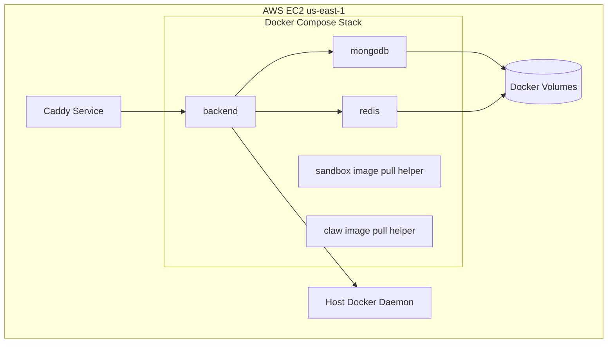
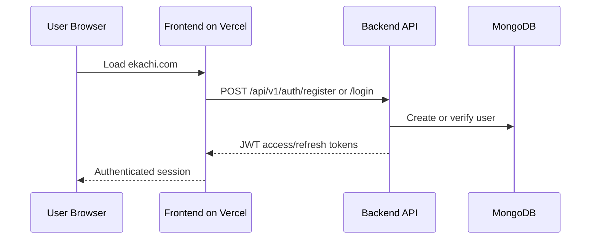
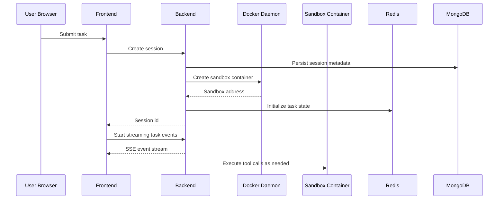
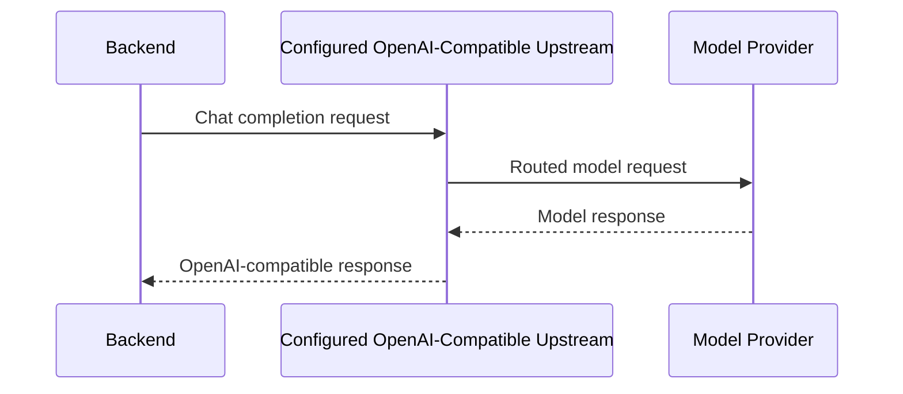

# Production System Architecture

This document describes the production architecture currently used for Ekachi.

## Overview

Ekachi is deployed as a split-stack system:

- `ekachi.com` serves the Vue frontend from Vercel
- `api.ekachi.com` serves the FastAPI backend from an AWS EC2 host in `us-east-1`
- MongoDB and Redis run on the same EC2 host as managed Docker containers
- The backend creates per-session sandbox containers and Claw containers through the host Docker daemon
- Model traffic is routed directly to the configured OpenAI-compatible upstream defined by `API_BASE`

## Production Topology

```mermaid
flowchart LR
    user[End User Browser]
    vercel[Vercel Project\nFrontend SPA]
    caddy[Caddy on AWS EC2\napi.ekachi.com]
    backend[FastAPI Backend Container]
    mongo[(MongoDB Container)]
    redis[(Redis Container)]
    docker[Docker Daemon]
    sandbox[Ephemeral Sandbox Containers]
    claw[Ephemeral Claw Containers]
    llm[Configured OpenAI-Compatible Upstream\n(API_BASE)]

    user -->|HTTPS| vercel
    user -->|HTTPS /api calls| caddy
    caddy --> backend
    backend --> mongo
    backend --> redis
    backend --> docker
    docker --> sandbox
    docker --> claw
    backend -->|LLM requests| llm
    claw -->|callback to backend| backend
```

## Production Infrastructure

### Frontend

- Platform: Vercel
- Domain: `ekachi.com`
- Build input: `frontend/`
- Runtime model: static SPA served by Vercel CDN
- Required frontend environment variable:
  - `VITE_API_URL=https://api.ekachi.com`

### Backend

- Platform: AWS EC2 (`us-east-1`)
- Reverse proxy: Caddy
- Public API origin: `https://api.ekachi.com`
- Private backend port: `127.0.0.1:8000`
- Deployment mode: Docker Compose
- Secrets source: AWS Secrets Manager

### Data Services

- MongoDB container for persistent application state
- Redis container with AOF enabled for task coordination and transient state

### Runtime Services

- Docker socket mounted read-only into the backend container
- Backend creates isolated sandbox containers on demand
- Backend creates Claw containers on demand

### Model Layer

- Provider pattern: OpenAI-compatible base URL
- Runtime endpoint: `API_BASE`
- Runtime model: `MODEL_NAME`
- OpenClaw proxy requests use OpenAI-compatible chat completions against the configured upstream
- Azure OpenAI-compatible upstreams are supported via `api-key` authentication in the OpenClaw proxy path

## Deployment Layout On AWS EC2



## Request Flows

### 1. User Authentication



Notes:

- Current auth provider is `password`
- Public registration is enabled
- Password reset email requires SMTP and is not part of the current live setup

### 2. Agent Session Creation



### 3. LLM Invocation Path



## Runtime Configuration

The live system depends on these configuration groups:

### Required Application Secrets

- `API_KEY`
- `API_BASE`
- `MODEL_NAME`
- `JWT_SECRET_KEY`
- `PASSWORD_SALT`

### Required Service Configuration

- `MONGODB_URI`
- `REDIS_HOST`
- `REDIS_PORT`
- `SANDBOX_IMAGE`
- `SANDBOX_NETWORK`
- `SANDBOX_NAME_PREFIX`
- `CLAW_IMAGE`
- `MANUS_API_BASE_URL`

### Frontend Configuration

- `VITE_API_URL`

## Operations

### Deploy Process

1. Push code to the standalone GitHub repository.
2. Vercel rebuilds or redeploys the frontend for `ekachi.com`.
3. Backend changes are deployed on the AWS EC2 host via `deploy/aws/deploy.sh`.
4. Caddy terminates TLS and proxies traffic to the backend container.

### Observability State

Current production setup includes basic service availability checks only. It does not yet include:

- centralized log aggregation
- metrics dashboards
- automated backups verification
- alerting
- blue/green or rolling backend deployment

## Known Architectural Constraints

- The backend is stateful and Docker-dependent, so it cannot be moved unchanged to Vercel Functions.
- MongoDB, Redis, backend, and Docker runtime currently share one AWS EC2 host, which is operationally simple but a single point of failure.
- Domain routing for the frontend currently depends on Vercel project/domain configuration and should remain attached to the Ekachi project for automatic production cutover.

## Current Live Endpoints

- `https://ekachi.com`
- `https://api.ekachi.com`
